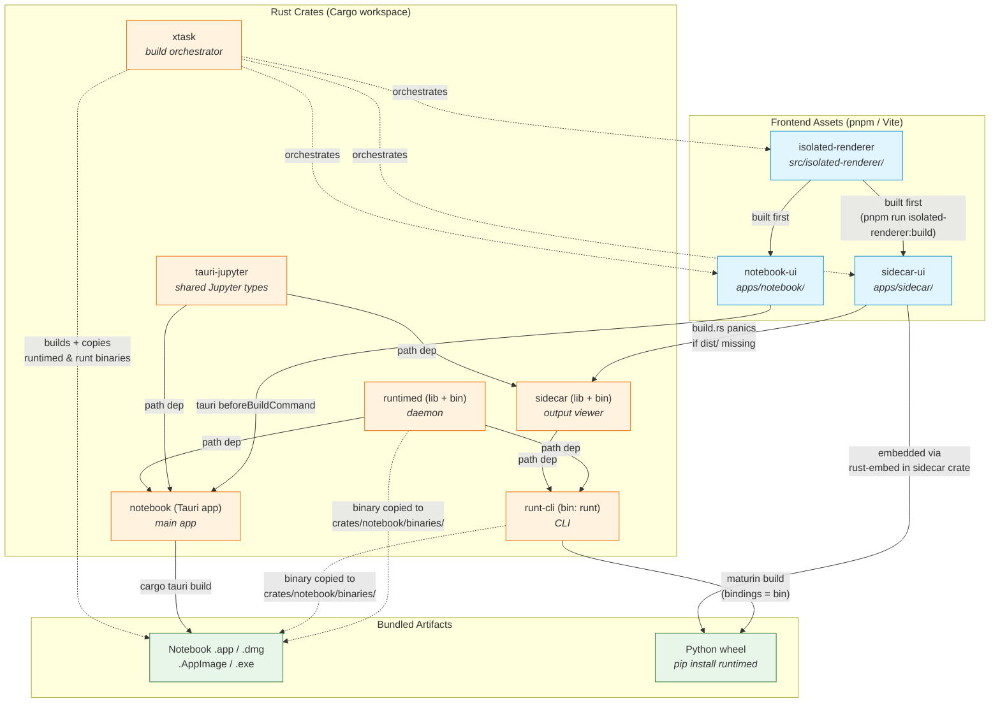
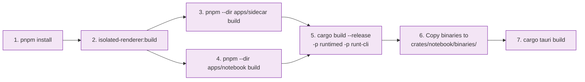
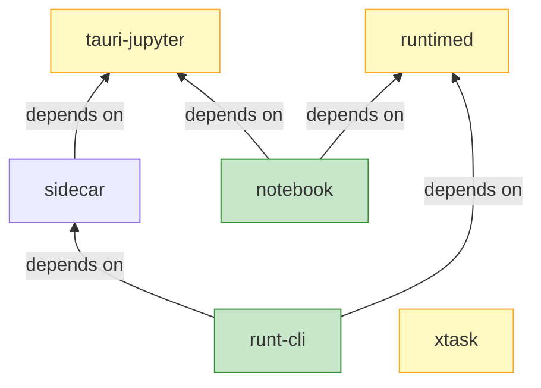

# Build & Dependency Diagram

This document shows how the crates, frontend apps, and final artifacts depend on
each other. The key insight: the Notebook app (Tauri) bundles `runtimed` and
`runt` as sidecar binaries, so those must be built **before** the Tauri bundle
step. Similarly, frontend assets must be built before their consuming Rust crates
compile.

> **Note:** PR [#209](https://github.com/runtimed/runt/pull/209) improves the
> dev workflow so `cargo xtask dev` handles the sidecar binary build
> automatically, but for release builds the dependency chain below still applies.

## Full Build Dependency Graph

## Build Order (step by step)

The `cargo xtask build` / `cargo xtask build-app` commands automate this, but
here is what happens under the hood:

## Rust Crate Dependency Graph

Shows only the Cargo `path` dependencies between workspace members:

## Key Points

| Constraint | Why |
|---|---|
| `sidecar-ui` must build before `sidecar` crate | `build.rs` panics if `apps/sidecar/dist/index.html` is missing — the UI is embedded via `rust-embed` |
| `notebook-ui` must build before Tauri bundle | `tauri.conf.json` `beforeBuildCommand` runs `pnpm --dir apps/notebook build` |
| `runtimed` + `runt` binaries must exist in `crates/notebook/binaries/` | `tauri.conf.json` lists them in `bundle.externalBin` — Tauri bundles them into the .app/.dmg/.exe |
| `isolated-renderer` builds first | Both `sidecar-ui` and `notebook-ui` depend on it (root `pnpm build` runs it first) |
| `xtask` has no Cargo deps | It shells out to `cargo build`, `pnpm`, and `cargo tauri` to orchestrate the full build |
| Python wheel uses maturin | `python/runtimed/pyproject.toml` points `maturin` at `crates/runt/Cargo.toml` with `bindings = "bin"` |
