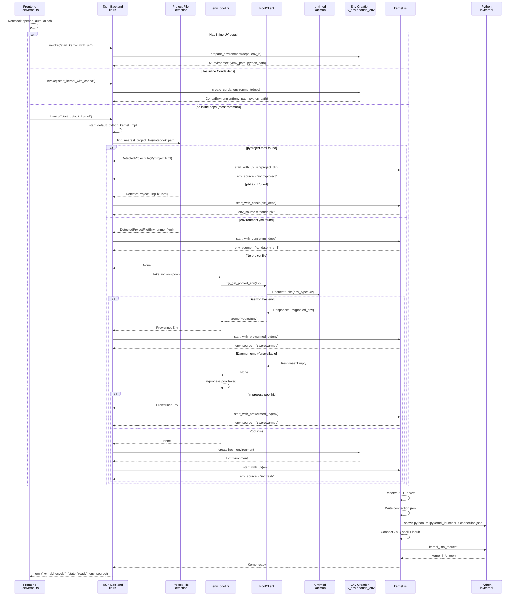
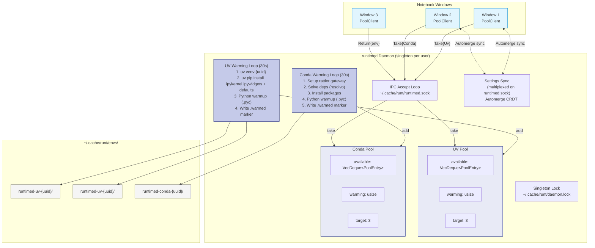

# Environment Management Architecture

This guide covers how Runt creates and manages Python and Deno environments for notebooks.

## Overview

When a user opens a notebook, Runt determines what kernel to launch based on a two-stage detection:

1. **Runtime Detection** — Is this a Python or Deno notebook?
2. **Environment Resolution** — For Python notebooks, what environment should we use?

This design allows Python and Deno notebooks to coexist in the same project directory.

```
Notebook opened
  │
  ├─ Check notebook kernelspec ────────── metadata.kernelspec.name
  │   │
  │   ├─ "deno" ───────────────────────── Launch Deno kernel (bootstrap via rattler)
  │   │
  │   ├─ "python" / "python3" ─────────── Resolve Python environment:
  │   │   │
  │   │   ├─ Has inline deps? ─────────── Use UV or Conda with those deps
  │   │   │
  │   │   ├─ Closest project file?        (walk up from notebook, stop at .git / home)
  │   │   │   ├─ pyproject.toml ───────── Use `uv run` (project's .venv)
  │   │   │   ├─ pixi.toml ────────────── Convert to conda deps, use rattler
  │   │   │   └─ environment.yml ──────── Use conda with parsed deps
  │   │   │
  │   │   └─ Nothing found ────────────── Claim prewarmed env from pool
  │   │
  │   └─ Unknown/missing ──────────────── Use default_runtime setting
  │
  └─ New notebook ─────────────────────── Use default_runtime setting (Python or Deno)
```

## Kernel Launching Architecture

Kernel launching is handled by the `runtimed` daemon, which manages both Python and Deno kernels. The shared `kernel-launch` crate provides tool bootstrapping used by both the notebook app and daemon.

### Tool Bootstrapping

Tools (deno, uv, ruff) are automatically installed from conda-forge if not found on PATH:

```rust
use kernel_launch::tools;

let deno = tools::get_deno_path().await?;  // PATH or ~/.cache/runt/tools/deno-{hash}/
let uv = tools::get_uv_path().await?;
let ruff = tools::get_ruff_path().await?;
```

This ensures the app works standalone without requiring users to install Python tooling.

## System Architecture Diagram

```mermaid
graph TB
    subgraph Frontend ["Frontend (TypeScript)"]
        UK[useKernel.ts]
        UD[useDependencies.ts]
        UCD[useCondaDependencies.ts]
        DH[DependencyHeader.tsx]
        CDH[CondaDependencyHeader.tsx]

        DH --> UD
        CDH --> UCD
    end

    subgraph TauriCmds ["Tauri Commands (lib.rs)"]
        SDK[start_default_kernel]
        SKUV[start_kernel_with_uv]
        SKC[start_kernel_with_conda]
        SKPP[start_kernel_with_pyproject]
        SKEY[start_kernel_with_environment_yml]
        SKD[start_kernel_with_deno]
        SDKI[start_default_python_kernel_impl]
        VNT[verify_notebook_trust]
        SYN[sync_kernel_dependencies]
        DETP[detect_pyproject / detect_pixi_toml / detect_environment_yml]
    end

    subgraph Detection ["Project File Detection"]
        PF[project_file.rs<br/>find_nearest_project_file]
        PP[pyproject.rs<br/>parse_pyproject]
        PX[pixi.rs<br/>parse_pixi_toml]
        EY[environment_yml.rs<br/>parse_environment_yml]
    end

    subgraph EnvCreation ["Environment Creation"]
        UE[uv_env.rs<br/>prepare_environment<br/>create_prewarmed_environment]
        CE[conda_env.rs<br/>create_conda_environment<br/>create_prewarmed_conda_environment]
        DE[deno_env.rs<br/>check_deno_available]
    end

    subgraph Pool ["Prewarmed Pool (env_pool.rs)"]
        TUV[take_uv_env]
        TCD[take_conda_env]
        IPP[In-Process Pool<br/>Vec&lt;PrewarmedEnv&gt;]
    end

    subgraph Kernel ["Kernel Process (kernel.rs)"]
        KUV[start_with_uv]
        KPUV[start_with_prewarmed_uv]
        KUR[start_with_uv_run]
        KC[start_with_conda]
        KPC[start_with_prewarmed_conda]
        KD[start_with_deno]
        JP[Jupyter Protocol<br/>ZMQ shell/iopub/stdin]
    end

    subgraph Daemon ["runtimed Daemon (separate process)"]
        DM[daemon.rs<br/>Pool Management]
        UWL[UV Warming Loop<br/>every 30s]
        CWL[Conda Warming Loop<br/>every 30s]
        SS[Settings Sync Server<br/>Automerge CRDT]
        PC[PoolClient<br/>IPC: Unix socket / Named pipe]
        PROT[Length-prefixed JSON<br/>Take / Return / Status / Ping]

        DM --> UWL
        DM --> CWL
        DM --> SS
    end

    subgraph External ["External Tools"]
        UV[uv CLI]
        RAT[rattler<br/>Conda solver + installer]
        DENO[deno CLI]
        PY[Python / ipykernel]
    end

    %% Frontend → Tauri commands
    UK -->|"invoke(start_default_kernel)"| SDK
    UK -->|"invoke(start_kernel_with_uv)"| SKUV
    UK -->|"invoke(start_kernel_with_conda)"| SKC
    UK -->|"invoke(start_kernel_with_pyproject)"| SKPP
    UK -->|"invoke(start_kernel_with_environment_yml)"| SKEY
    UK -->|"invoke(start_kernel_with_deno)"| SKD
    UD -->|"invoke(sync_kernel_dependencies)"| SYN
    UD -->|"invoke(add/remove_dependency)"| SKUV
    UCD -->|"invoke(add/remove_conda_dependency)"| SKC
    UD -->|"invoke(detect_pyproject)"| DETP
    UCD -->|"invoke(detect_pixi_toml, detect_environment_yml)"| DETP

    %% Tauri events back to frontend
    SDK -.->|"emit kernel:lifecycle {state, env_source}"| UK
    VNT -.->|trust status| UD

    %% Tauri command orchestration
    SDK --> SDKI
    SDKI -->|"1. Check inline deps<br/>metadata.uv / metadata.conda"| SKUV
    SDKI -->|"2. Closest project file?"| PF
    SDKI -->|"3. No deps → prewarmed"| TUV
    SDKI -->|"3. No deps → prewarmed"| TCD

    %% Project file detection → env creation
    PF -->|pyproject.toml| PP
    PF -->|pixi.toml| PX
    PF -->|environment.yml| EY
    PP --> KUR
    PX -->|convert to CondaDependencies| KC
    EY -->|convert to CondaDependencies| KC

    %% start_kernel commands → kernel methods
    SKUV --> KUV
    SKC --> KC
    SKPP --> KUR
    SKEY --> KC
    SKD --> KD

    %% Pool → daemon (try daemon first, then in-process)
    TUV -->|"1. runtimed::client::try_get_pooled_env(Uv)"| PC
    TCD -->|"1. runtimed::client::try_get_pooled_env(Conda)"| PC
    TUV -->|"2. Fallback: in-process pool"| IPP
    TCD -->|"2. Fallback: in-process pool"| IPP
    PC -->|NDJSON over IPC| PROT
    PROT --> DM

    %% Pool → kernel start
    TUV --> KPUV
    TCD --> KPC

    %% Environment creation → external tools
    KUV --> UE
    UE -->|"uv venv + uv pip install"| UV
    KUR -->|"uv run --with ipykernel"| UV
    KC --> CE
    CE -->|"solve + install"| RAT
    KD -->|"deno jupyter --kernel"| DENO

    %% Daemon warming → external tools
    UWL -->|"uv venv + uv pip install + warmup"| UV
    CWL -->|"rattler solve + install + warmup"| RAT

    %% Kernel → Jupyter protocol
    KPUV --> JP
    KUV --> JP
    KUR --> JP
    KC --> JP
    KPC --> JP
    KD --> JP
    JP -->|"spawn python -m ipykernel_launcher"| PY

    %% Settings sync
    SS <-->|"Automerge sync messages<br/>length-prefixed binary"| UK

    %% Styling
    classDef frontend fill:#e1f5fe,stroke:#0288d1
    classDef tauri fill:#fff3e0,stroke:#f57c00
    classDef detection fill:#f3e5f5,stroke:#7b1fa2
    classDef env fill:#e8f5e9,stroke:#388e3c
    classDef pool fill:#fce4ec,stroke:#c62828
    classDef kernel fill:#fff9c4,stroke:#f9a825
    classDef daemon fill:#e8eaf6,stroke:#283593
    classDef external fill:#f5f5f5,stroke:#616161

    class UK,UD,UCD,DH,CDH frontend
    class SDK,SKUV,SKC,SKPP,SKEY,SKD,SDKI,VNT,SYN,DETP tauri
    class PF,PP,PX,EY detection
    class UE,CE,DE env
    class TUV,TCD,IPP pool
    class KUV,KPUV,KUR,KC,KPC,KD,JP kernel
    class DM,UWL,CWL,SS,PC,PROT daemon
    class UV,RAT,DENO,PY external
```



### Kernel Startup Sequence



### Daemon Pool Architecture



### Reading the Diagrams

The diagrams show three main layers and a separate daemon process:

1. **Frontend** (blue) — React hooks that invoke Tauri commands and listen for `kernel:lifecycle` events. `useKernel.ts` handles inline deps and Deno detection locally, then defers to the backend for project file detection via `startDefaultKernel()`.

2. **Tauri Backend** (orange) — `start_default_python_kernel_impl` runs the detection priority chain: inline deps first, then closest project file, then prewarmed pool. Each path delegates to a kernel start method.

3. **runtimed Daemon** (indigo) — A singleton background process managing prewarmed UV and Conda environment pools across all notebook windows. Communicates via length-prefixed JSON over Unix domain sockets (or Windows named pipes). Also runs an Automerge CRDT sync server for cross-window settings.

4. **External Tools** (grey) — `uv` for pip-compatible package management, `rattler` for conda solving/installing, and `deno` for TypeScript notebooks.

The prewarmed pool has a two-tier fallback: try the daemon first (shared across windows), then the in-process pool (local to this window), then create a fresh environment.

## Detection Priority Chain

Kernel launching uses a two-stage detection: **runtime detection** (Python vs Deno) followed by **environment resolution** (for Python only).

### Stage 1: Runtime Detection

The daemon reads the notebook's kernelspec to determine if it's a Python or Deno notebook:

| Priority | Source | Check | Result |
|----------|--------|-------|--------|
| 1 | Notebook metadata | `metadata.kernelspec.name == "deno"` | Launch Deno kernel |
| 2 | Notebook metadata | `metadata.kernelspec.name` contains "python" | Resolve Python environment |
| 3 | Notebook metadata | `metadata.kernelspec.language == "typescript"` | Launch Deno kernel |
| 4 | Notebook metadata | `metadata.language_info.name == "typescript"` | Launch Deno kernel |
| 5 | User setting | `default_runtime` preference | Python or Deno |

**Key invariant**: The notebook's encoded kernelspec takes priority over project files. A Deno notebook in a directory with `pyproject.toml` will launch a Deno kernel, not a Python kernel.

### Stage 2: Python Environment Resolution

For Python notebooks, the daemon resolves which environment to use:

| Priority | Source | Backend | Environment Type |
|----------|--------|---------|-----------------|
| 1 | Inline notebook metadata | uv or conda deps from `metadata.uv` / `metadata.conda` | Cached by dep hash |
| 2 | Closest project file | Single walk-up via `project_file::find_nearest_project_file` | Depends on file type |
| 3 | User preference | Prewarmed UV or Conda env from pool | Shared pool env |

For step 2, the walk-up checks for `pyproject.toml`, `pixi.toml`, and `environment.yml`/`environment.yaml` at **each directory level**, starting from the notebook's location. The first (closest) match wins. When multiple project files exist in the same directory, the tiebreaker order is: pyproject.toml > pixi.toml > environment.yml.

The walk-up stops at `.git` boundaries and the user's home directory, preventing cross-repository project file pollution.

| Project file | Backend | Environment Type | Pool |
|-------------|---------|-----------------|------|
| `pyproject.toml` | `uv run --with ipykernel` in project dir | Project `.venv/` | UV |
| `pixi.toml` | Convert pixi deps to `CondaDependencies`, use rattler | Cached by dep hash | Conda |
| `environment.yml` | Parse deps, use rattler | Cached by dep hash | Conda |

### Deno Kernel Launching

Deno kernels do not use environment pools. The daemon:

1. Gets the deno binary path via `kernel_launch::tools::get_deno_path()` (checks PATH first, then bootstraps from conda-forge)
2. Launches: `deno jupyter --kernel --conn <connection_file>`

**Note**: Deno notebooks do not look for project files. The `deno.json`/`deno.jsonc` detection is only used for Deno-specific configuration, not for determining kernel type.

### New Notebooks

When a user creates a new notebook (File → New), the kernel type is determined by:

- **New → Python Notebook**: Creates notebook with `kernelspec.name: "python3"`, uses `default_python_env` setting (UV or Conda) for the prewarmed pool
- **New → Deno Notebook**: Creates notebook with `kernelspec.name: "deno"`, launches Deno kernel

## Content-Addressed Caching

Environments are cached by a hash of their dependencies so notebooks with identical deps share a single environment.

**UV** (`uv_env.rs`):
- Hash = SHA256(sorted deps + requires_python + env_id), first 16 hex chars
- Location: `~/.cache/runt/envs/{hash}/`
- When deps are non-empty, env_id is excluded from hash (allows cross-notebook sharing)
- When deps are empty, env_id is included (per-notebook isolation)

**Conda** (`conda_env.rs`):
- Hash = SHA256(sorted deps + sorted channels + python version + env_id), first 16 hex chars
- Location: `~/.cache/runt/conda-envs/{hash}/`

Cache hit check: verify that `{hash}/bin/python` (Unix) or `{hash}/Scripts/python.exe` (Windows) exists.

## Prewarming and the Daemon Pool

To make notebook startup instant, Runt maintains a pool of pre-created environments with just `ipykernel` and `ipywidgets` installed.

**In-process pool** (`env_pool.rs`):
- Default size: 3 environments
- Max age: 2 days (172800 seconds)
- Maintained as `Vec<PrewarmedEnv>` in `EnvPool`

**Daemon pool** (`crates/runtimed/`):
- The `runtimed` daemon runs as a background process
- Manages its own environment pool across notebook windows
- Accessed via `runtimed::client::try_get_pooled_env()`
- Falls back to in-process pool if daemon is unavailable

Prewarmed environments have no `env_id` so they can be reused by any notebook that needs a bare environment.

## Project File Discovery

The unified project file detection lives in `project_file.rs` and is used by `start_default_python_kernel_impl` for kernel launch decisions:

| Module | Purpose |
|--------|---------|
| `project_file.rs` | `find_nearest_project_file()` — single walk-up checking all project file types at each level, closest wins |

Individual project file modules still exist for parsing, Tauri detection commands, and the dependency management UI:

| Module | File | Function |
|--------|------|----------|
| `pyproject.rs` | `pyproject.toml` | `find_pyproject()`, parsing, Tauri commands |
| `pixi.rs` | `pixi.toml` | `find_pixi_toml()`, parsing, Tauri commands |
| `environment_yml.rs` | `environment.yml` / `environment.yaml` | `find_environment_yml()`, parsing, Tauri commands |
| `deno_env.rs` | `deno.json` / `deno.jsonc` | `find_deno_config()` |

All walk-up functions (both unified and individual) stop at `.git` boundaries and the user's home directory.

Each per-format module provides:
- A parse function to extract dependencies
- Tauri commands for frontend detection (`detect_*`), dependency listing (`get_*_dependencies`), and import (`import_*_dependencies`)

## Notebook Metadata Schema

Dependencies and environment config are stored in notebook JSON metadata:

```json
{
  "metadata": {
    "kernelspec": {
      "name": "python3",
      "display_name": "Python 3",
      "language": "python"
    },
    "runt": {
      "schema_version": "1",
      "env_id": "uuid"
    },
    "uv": {
      "dependencies": ["pandas", "numpy"],
      "requires-python": ">=3.10"
    },
    "conda": {
      "dependencies": ["numpy", "scipy"],
      "channels": ["conda-forge"],
      "python": "3.12"
    },
    "deno": {
      "permissions": ["--allow-net", "--allow-read"],
      "config": "deno.json"
    }
  }
}
```

Note: The runtime type (Python vs Deno) is determined by `kernelspec.name`, not by a field in `runt`. The kernelspec is the standard Jupyter metadata field.

`runt.env_id` is the canonical per-notebook identifier used for environment isolation.

## Trust System

Dependencies are signed with HMAC-SHA256 to prevent untrusted code execution on notebook open.

- **Key**: 32 random bytes stored at `~/.config/runt/trust-key`, generated on first use
- **Signed content**: Canonical JSON of `metadata.uv` + `metadata.conda` (not cell contents or outputs)
- **Signature format**: `"hmac-sha256:{hex_digest}"` stored in notebook metadata
- **Machine-specific**: The key is per-machine, so every shared notebook is untrusted on the recipient's machine
- **Verification**: `trust.rs:verify_signature()` returns `TrustStatus`: Trusted, Untrusted, SignatureInvalid, or NoDependencies

Changes to the dependency metadata structure require updating the signing logic in `crates/notebook/src/trust.rs`.

## Frontend Architecture

Two parallel UI components manage dependencies:

| Component | Hook | Manages |
|-----------|------|---------|
| `DependencyHeader.tsx` | `useDependencies.ts` | UV deps, pyproject.toml detection |
| `CondaDependencyHeader.tsx` | `useCondaDependencies.ts` | Conda deps, environment.yml and pixi.toml detection |

The kernel lifecycle is managed by `useKernel.ts`, which:
- Listens for `kernel:lifecycle` events from the backend
- Captures the `env_source` string (e.g. `"uv:pyproject"`, `"conda:pixi"`)
- Runs auto-launch detection on notebook open

## Testing

**Unit tests**: Each project file module has thorough tests. `environment_yml.rs` is the best exemplar — it covers discovery logic, parsing edge cases, and conversion to `CondaDependencies`.

**Test fixtures**: `crates/notebook/fixtures/audit-test/` contains numbered test notebooks:
- `1-vanilla.ipynb` — no dependencies
- `2-uv-inline.ipynb` — inline UV dependencies
- `3-conda-inline.ipynb` — inline conda dependencies
- `4-both-deps.ipynb` — both UV and conda
- `pyproject-project/5-pyproject.ipynb` — notebook next to pyproject.toml
- `pixi-project/6-pixi.ipynb` — notebook next to pixi.toml
- `conda-env-project/7-environment-yml.ipynb` — notebook next to environment.yaml

**E2E tests**: `e2e/specs/` contains WebDriverIO tests that build the app and verify kernel startup with each environment type. See `contributing/e2e.md` for the E2E testing guide.

## Key Files

### Shared Kernel Launch Crate

| File | Role |
|------|------|
| `crates/kernel-launch/src/lib.rs` | Public API for kernel launching |
| `crates/kernel-launch/src/tools.rs` | Tool bootstrapping (deno, uv, ruff) via rattler |

### Daemon (Kernel Management)

| File | Role |
|------|------|
| `crates/runtimed/src/daemon.rs` | Background daemon pool management, passes settings to handlers |
| `crates/runtimed/src/notebook_sync_server.rs` | `auto_launch_kernel()` — runtime detection and environment resolution |
| `crates/runtimed/src/kernel_manager.rs` | `RoomKernel::launch()` — spawns Python or Deno kernel processes |

### Notebook Crate (Tauri Commands)

| File | Role |
|------|------|
| `crates/notebook/src/lib.rs` | Tauri commands, `start_default_python_kernel_impl` |
| `crates/notebook/src/project_file.rs` | Unified closest-wins project file detection |
| `crates/notebook/src/kernel.rs` | Kernel process management, `start_with_uv`/`start_with_conda`/`start_with_uv_run` |
| `crates/notebook/src/uv_env.rs` | UV environment creation, dep hashing, caching |
| `crates/notebook/src/conda_env.rs` | Conda environment creation via rattler |
| `crates/notebook/src/env_pool.rs` | Prewarmed environment pool (daemon + in-process) |
| `crates/notebook/src/pyproject.rs` | pyproject.toml discovery and parsing |
| `crates/notebook/src/pixi.rs` | pixi.toml discovery and parsing |
| `crates/notebook/src/environment_yml.rs` | environment.yml discovery and parsing |
| `crates/notebook/src/deno_env.rs` | Deno config detection |
| `crates/notebook/src/notebook_state.rs` | Notebook metadata and new notebook creation |
| `crates/notebook/src/settings.rs` | User preferences (default runtime, env type) |
| `crates/notebook/src/trust.rs` | HMAC trust verification |

### Frontend

| File | Role |
|------|------|
| `apps/notebook/src/hooks/useKernel.ts` | Frontend kernel lifecycle and auto-launch |
| `apps/notebook/src/hooks/useDependencies.ts` | Frontend UV dep management |
| `apps/notebook/src/hooks/useCondaDependencies.ts` | Frontend conda dep management |
| `apps/notebook/src/components/DependencyHeader.tsx` | UV dependency UI panel |
| `apps/notebook/src/components/CondaDependencyHeader.tsx` | Conda dependency UI panel |
